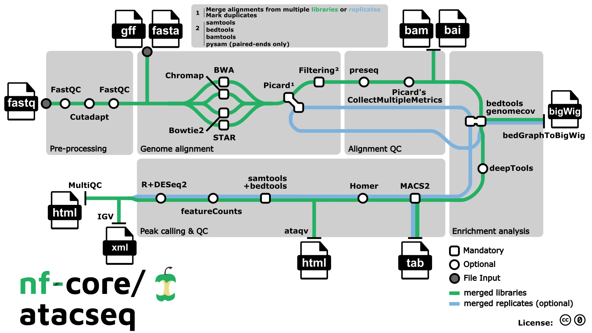

#  

[](https://github.com/nf-core/atacseq/actions?query=workflow%3A%22nf-core+CI%22)
[](https://github.com/nf-core/atacseq/actions?query=workflow%3A%22nf-core+linting%22)[](https://nf-co.re/atacseq/results)[](https://doi.org/10.5281/zenodo.2634132)

[](https://www.nextflow.io/)
[](https://docs.conda.io/en/latest/)
[](https://www.docker.com/)
[](https://sylabs.io/docs/)
[](https://tower.nf/launch?pipeline=https://github.com/nf-core/atacseq)

[](https://nfcore.slack.com/channels/atacseq)[](https://twitter.com/nf_core)[](https://mstdn.science/@nf_core)[](https://www.youtube.com/c/nf-core)

## Introduction

**nfcore/atacseq** is a bioinformatics analysis pipeline used for ATAC-seq data.

The pipeline is built using [Nextflow](https://www.nextflow.io), a workflow tool to run tasks across multiple compute infrastructures in a very portable manner. It uses Docker/Singularity containers making installation trivial and results highly reproducible. The [Nextflow DSL2](https://www.nextflow.io/docs/latest/dsl2.html) implementation of this pipeline uses one container per process which makes it much easier to maintain and update software dependencies. Where possible, these processes have been submitted to and installed from [nf-core/modules](https://github.com/nf-core/modules) in order to make them available to all nf-core pipelines, and to everyone within the Nextflow community!

On release, automated continuous integration tests run the pipeline on a full-sized dataset on the AWS cloud infrastructure. This ensures that the pipeline runs on AWS, has sensible resource allocation defaults set to run on real-world datasets, and permits the persistent storage of results to benchmark between pipeline releases and other analysis sources.The results obtained from the full-sized test can be viewed on the [nf-core website](https://nf-co.re/atacseq/results).

## Pipeline summary



1. Raw read QC ([`FastQC`](https://www.bioinformatics.babraham.ac.uk/projects/fastqc/))
2. Adapter trimming ([`Trim Galore!`](https://www.bioinformatics.babraham.ac.uk/projects/trim_galore/))
3. Choice of multiple aligners
   1.([`BWA`](https://sourceforge.net/projects/bio-bwa/files/))
   2.([`Chromap`](https://github.com/haowenz/chromap)). **For paired-end reads only working until mapping steps, see [here](https://github.com/nf-core/chipseq/issues/291)**
   3.([`Bowtie2`](http://bowtie-bio.sourceforge.net/bowtie2/index.shtml))
   4.([`STAR`](https://github.com/alexdobin/STAR))
4. Mark duplicates ([`picard`](https://broadinstitute.github.io/picard/))
5. Merge alignments from multiple libraries of the same sample ([`picard`](https://broadinstitute.github.io/picard/))
   1. Re-mark duplicates ([`picard`](https://broadinstitute.github.io/picard/))
   2. Filtering to remove:
      - reads mapping to mitochondrial DNA ([`SAMtools`](https://sourceforge.net/projects/samtools/files/samtools/))
      - reads mapping to blacklisted regions ([`SAMtools`](https://sourceforge.net/projects/samtools/files/samtools/), [`BEDTools`](https://github.com/arq5x/bedtools2/))
      - reads that are marked as duplicates ([`SAMtools`](https://sourceforge.net/projects/samtools/files/samtools/))
      - reads that are not marked as primary alignments ([`SAMtools`](https://sourceforge.net/projects/samtools/files/samtools/))
      - reads that are unmapped ([`SAMtools`](https://sourceforge.net/projects/samtools/files/samtools/))
      - reads that map to multiple locations ([`SAMtools`](https://sourceforge.net/projects/samtools/files/samtools/))
      - reads containing > 4 mismatches ([`BAMTools`](https://github.com/pezmaster31/bamtools))
      - reads that are soft-clipped ([`BAMTools`](https://github.com/pezmaster31/bamtools))
      - reads that have an insert size > 2kb ([`BAMTools`](https://github.com/pezmaster31/bamtools); _paired-end only_)
      - reads that map to different chromosomes ([`Pysam`](http://pysam.readthedocs.io/en/latest/installation.html); _paired-end only_)
      - reads that arent in FR orientation ([`Pysam`](http://pysam.readthedocs.io/en/latest/installation.html); _paired-end only_)
      - reads where only one read of the pair fails the above criteria ([`Pysam`](http://pysam.readthedocs.io/en/latest/installation.html); _paired-end only_)
   3. Alignment-level QC and estimation of library complexity ([`picard`](https://broadinstitute.github.io/picard/), [`Preseq`](http://smithlabresearch.org/software/preseq/))
   4. Create normalised bigWig files scaled to 1 million mapped reads ([`BEDTools`](https://github.com/arq5x/bedtools2/), [`bedGraphToBigWig`](http://hgdownload.soe.ucsc.edu/admin/exe/))
   5. Generate gene-body meta-profile from bigWig files ([`deepTools`](https://deeptools.readthedocs.io/en/develop/content/tools/plotProfile.html))
   6. Calculate genome-wide enrichment (optionally relative to control) ([`deepTools`](https://deeptools.readthedocs.io/en/develop/content/tools/plotFingerprint.html))
   7. Call broad/narrow peaks ([`MACS2`](https://github.com/macs3-project/MACS))
   8. Annotate peaks relative to gene features ([`HOMER`](http://homer.ucsd.edu/homer/download.html))
   9. Create consensus peakset across all samples and create tabular file to aid in the filtering of the data ([`BEDTools`](https://github.com/arq5x/bedtools2/))
   10. Count reads in consensus peaks ([`featureCounts`](http://bioinf.wehi.edu.au/featureCounts/))
   11. Differential accessibility analysis, PCA and clustering ([`R`](https://www.r-project.org/), [`DESeq2`](https://bioconductor.org/packages/release/bioc/html/DESeq2.html))
   12. Generate ATAC-seq specific QC html report ([`ataqv`](https://github.com/ParkerLab/ataqv))
6. Merge filtered alignments across replicates ([`picard`](https://broadinstitute.github.io/picard/))
   1. Re-mark duplicates ([`picard`](https://broadinstitute.github.io/picard/))
   2. Remove duplicate reads ([`SAMtools`](https://sourceforge.net/projects/samtools/files/samtools/))
   3. Create normalised bigWig files scaled to 1 million mapped reads ([`BEDTools`](https://github.com/arq5x/bedtools2/), [`bedGraphToBigWig`](http://hgdownload.soe.ucsc.edu/admin/exe/))
   4. Call broad/narrow peaks ([`MACS2`](https://github.com/macs3-project/MACS))
   5. Annotate peaks relative to gene features ([`HOMER`](http://homer.ucsd.edu/homer/download.html))
   6. Create consensus peakset across all samples and create tabular file to aid in the filtering of the data ([`BEDTools`](https://github.com/arq5x/bedtools2/))
   7. Count reads in consensus peaks relative to merged library-level alignments ([`featureCounts`](http://bioinf.wehi.edu.au/featureCounts/))
   8. Differential accessibility analysis, PCA and clustering ([`R`](https://www.r-project.org/), [`DESeq2`](https://bioconductor.org/packages/release/bioc/html/DESeq2.html))
7. Create IGV session file containing bigWig tracks, peaks and differential sites for data visualisation ([`IGV`](https://software.broadinstitute.org/software/igv/)).
8. Present QC for raw read, alignment, peak-calling and differential accessibility results ([`ataqv`](https://github.com/ParkerLab/ataqv), [`MultiQC`](http://multiqc.info/), [`R`](https://www.r-project.org/))

## Usage

:::note
If you are new to Nextflow and nf-core, please refer to [this page](https://nf-co.re/docs/usage/installation) on how
to set-up Nextflow. Make sure to [test your setup](https://nf-co.re/docs/usage/introduction#how-to-run-a-pipeline)
with `-profile test` before running the workflow on actual data.
:::

To run on your data, prepare a tab-separated samplesheet with your input data. Please follow the [documentation on samplesheets](https://nf-co.re/atacseq/usage#samplesheet-input) for more details. An example samplesheet for running the pipeline looks as follows:

```csv
sample,fastq_1,fastq_2,replicate
CONTROL,AEG588A1_S1_L002_R1_001.fastq.gz,AEG588A1_S1_L002_R2_001.fastq.gz,1
CONTROL,AEG588A1_S1_L003_R1_001.fastq.gz,AEG588A1_S1_L003_R2_001.fastq.gz,2
CONTROL,AEG588A1_S1_L004_R1_001.fastq.gz,AEG588A1_S1_L004_R2_001.fastq.gz,3
```

Now, you can run the pipeline using:

```bash
nextflow run nf-core/atacseq --input samplesheet.csv --outdir <OUTDIR> --genome GRCh37 --read_length <50|100|150|200> -profile <docker/singularity/podman/shifter/charliecloud/conda/institute>
```

See [usage docs](https://nf-co.re/atacseq/usage) for all of the available options when running the pipeline.

:::warning
Please provide pipeline parameters via the CLI or Nextflow `-params-file` option. Custom config files including those
provided by the `-c` Nextflow option can be used to provide any configuration _**except for parameters**_;
see [docs](https://nf-co.re/usage/configuration#custom-configuration-files).
:::

For more details and further functionality, please refer to the [usage documentation](https://nf-co.re/atacseq/usage) and the [parameter documentation](https://nf-co.re/atacseq/parameters).

## Pipeline output

To see the results of an example test run with a full size dataset refer to the [results](https://nf-co.re/atacseq/results) tab on the nf-core website pipeline page.
For more details about the output files and reports, please refer to the
[output documentation](https://nf-co.re/atacseq/output).

## Credits

The pipeline was originally written by Harshil Patel ([@drpatelh](https://github.com/drpatelh)) from [Seqera Labs, Spain](https://seqera.io/) and converted to Nextflow DSL2 by Björn Langer ([@bjlang](https://github.com/bjlang)) and Jose Espinosa-Carrasco ([@JoseEspinosa](https://github.com/JoseEspinosa)) from [The Comparative Bioinformatics Group](https://www.crg.eu/en/cedric_notredame) at [The Centre for Genomic Regulation, Spain](https://www.crg.eu/) under the umbrella of the [BovReg project](https://www.bovreg.eu/).

Many thanks to others who have helped out and contributed along the way too, including (but not limited to): [@ewels](https://github.com/ewels), [@apeltzer](https://github.com/apeltzer), [@crickbabs](https://github.com/crickbabs), [drewjbeh](https://github.com/drewjbeh), [@houghtos](https://github.com/houghtos), [@jinmingda](https://github.com/jinmingda), [@ktrns](https://github.com/ktrns), [@MaxUlysse](https://github.com/MaxUlysse), [@mashehu](https://github.com/mashehu), [@micans](https://github.com/micans), [@pditommaso](https://github.com/pditommaso) and [@sven1103](https://github.com/sven1103).

## Contributions and Support

If you would like to contribute to this pipeline, please see the [contributing guidelines](.github/CONTRIBUTING.md).

For further information or help, don't hesitate to get in touch on the [Slack `#atacseq` channel](https://nfcore.slack.com/channels/atacseq) (you can join with [this invite](https://nf-co.re/join/slack)).

## Citations

If you use nf-core/atacseq for your analysis, please cite it using the following doi: [10.5281/zenodo.2634132](https://doi.org/10.5281/zenodo.2634132)

An extensive list of references for the tools used by the pipeline can be found in the [`CITATIONS.md`](CITATIONS.md) file.

You can cite the `nf-core` publication as follows:

> **The nf-core framework for community-curated bioinformatics pipelines.**
>
> Philip Ewels, Alexander Peltzer, Sven Fillinger, Harshil Patel, Johannes Alneberg, Andreas Wilm, Maxime Ulysse Garcia, Paolo Di Tommaso & Sven Nahnsen.
>
> _Nat Biotechnol._ 2020 Feb 13. doi: [10.1038/s41587-020-0439-x](https://dx.doi.org/10.1038/s41587-020-0439-x).
